# Website Optimization Technical Design

## Architecture Overview


## Component Structure

### 1. Hero Section Fix


**Implementation Details:**
```css
/* Critical CSS - Inline in <head> */
.hero {
    background: #5a67d8; /* Fallback solid color */
    background: linear-gradient(135deg, #667eea 0%, #764ba2 100%);
}

.hero-content {
    opacity: 1 !important; /* Override animation initial state */
    transform: none !important;
}

@supports (animation: fadeInUp 0.8s) {
    .hero-content {
        opacity: 0;
        animation: fadeInUp 0.8s ease forwards;
    }
}
```

### 2. GitHub API Caching System


**Cache Implementation:**
```javascript
class GitHubCache {
    constructor() {
        this.CACHE_KEY = 'github_projects';
        this.CACHE_DURATION = 3600000; // 1 hour
    }
    
    async getProjects() {
        const cached = this.getFromCache();
        if (cached) return cached;
        
        const fresh = await this.fetchFromAPI();
        this.saveToCache(fresh);
        return fresh;
    }
    
    getFromCache() {
        const stored = localStorage.getItem(this.CACHE_KEY);
        if (!stored) return null;
        
        const { data, timestamp } = JSON.parse(stored);
        const isExpired = Date.now() - timestamp > this.CACHE_DURATION;
        
        return isExpired ? null : data;
    }
}
```

### 3. Image Optimization Strategy

```mermaid
graph TD
    A[Image Loading] --> B{Image Type?}
    B -->|App Icon| C[Lazy Load]
    B -->|Hero Image| D[Critical Load]
    B -->|Project Image| E[Progressive Load]
    
    C --> F[IntersectionObserver]
    D --> G[Preload Tag]
    E --> H[Blur-up Technique]
    
    F --> I[Load on Viewport]
    G --> J[Load Immediately]
    H --> K[Low-res → High-res]
```



### 4. iOS App Card Enhancement

```html
<!-- Enhanced App Card Structure -->
<div class="app-card" data-app-id="aimbti" data-status="review">
    <div class="app-icon-wrapper">
        
        <span class="app-status-badge">In Review</span>
    </div>
    <h3>AIMBTi</h3>
    <p class="app-version">iOS 1.0</p>
    <button class="app-details-btn" aria-label="View details for AIMBTi">
        View Details
    </button>
</div>
```

### 5. Dark Mode Implementation


### 6. Performance Optimization

**Critical Rendering Path:**
```html
<!DOCTYPE html>
<html lang="en">
<head>
    <!-- Critical CSS inline -->
    <style>
        /* Extracted critical CSS for above-fold content */
        :root { /* color variables */ }
        body { /* base styles */ }
        .hero { /* hero section critical styles */ }
        /* ~500 bytes of critical CSS */
    </style>
    
    <!-- Preload critical resources -->
    <link rel="preload" href="css/style.css" as="style">
    <link rel="preload" href="js/main.js" as="script">
    
    <!-- Async load non-critical CSS -->
    <link rel="stylesheet" href="css/style.css" media="print" onload="this.media='all'">
    
    <!-- Preconnect to external domains -->
    <link rel="preconnect" href="https://api.github.com">
    <link rel="preconnect" href="https://cdnjs.cloudflare.com">
</head>
```

### 7. SEO & Structured Data

```json
{
  "@context": "https://schema.org",
  "@type": "Person",
  "name": "Wei Fu",
  "url": "https://weiproduct.github.io/ME",
  "alumniOf": [
    {
      "@type": "EducationalOrganization",
      "name": "University Name"
    }
  ],
  "hasCredential": [
    {
      "@type": "EducationalOccupationalCredential",
      "credentialCategory": "degree",
      "educationalLevel": "Bachelor's Degree",
      "name": "Computer Science"
    },
    {
      "@type": "EducationalOccupationalCredential",
      "credentialCategory": "degree",
      "educationalLevel": "Bachelor's Degree",
      "name": "Managerial Economics"
    }
  ],
  "knowsAbout": ["iOS Development", "Web Development", "Economics", "Business Strategy"],
  "owns": {
    "@type": "SoftwareApplication",
    "applicationCategory": "Mobile Apps",
    "operatingSystem": "iOS"
  }
}
```

## Data Models

### Project Model
```typescript
interface GitHubProject {
    id: number;
    name: string;
    description: string | null;
    html_url: string;
    homepage: string | null;
    language: string | null;
    stargazers_count: number;
    forks_count: number;
    updated_at: string;
    topics: string[];
}
```

### App Model
```typescript
interface iOSApp {
    id: string;
    name: string;
    nameEn?: string;
    icon: string;
    version: string;
    status: 'published' | 'review' | 'rejected' | 'preparing';
    description?: string;
    features?: string[];
    screenshots?: string[];
    appStoreUrl?: string;
    category?: string;
}
```

### Theme Model
```typescript
interface Theme {
    name: 'light' | 'dark' | 'auto';
    colors: {
        primary: string;
        secondary: string;
        background: string;
        surface: string;
        text: string;
        textSecondary: string;
    };
}
```

## API Endpoints

### GitHub API Integration
- **Endpoint**: `https://api.github.com/users/WeiProduct/repos`
- **Parameters**: `?sort=updated&per_page=20`
- **Rate Limit**: 60 requests/hour (unauthenticated)
- **Caching**: LocalStorage with 1-hour TTL

### Contact Form Endpoint
- **Service**: Formspree or Netlify Forms
- **Endpoint**: `https://formspree.io/f/{form-id}`
- **Method**: POST
- **Fields**: name, email, subject, message
- **Validation**: Client-side + server-side

## Component API

### LazyImage Component
```javascript
class LazyImage {
    constructor(element, options = {}) {
        this.element = element;
        this.options = {
            root: null,
            rootMargin: '50px',
            threshold: 0.01,
            ...options
        };
    }
    
    observe() {
        const observer = new IntersectionObserver(
            this.handleIntersection.bind(this),
            this.options
        );
        observer.observe(this.element);
    }
}
```

### ThemeManager Component
```javascript
class ThemeManager {
    constructor() {
        this.theme = this.detectTheme();
        this.listeners = new Set();
    }
    
    detectTheme() {
        // Check localStorage
        const stored = localStorage.getItem('theme');
        if (stored) return stored;
        
        // Check system preference
        if (window.matchMedia('(prefers-color-scheme: dark)').matches) {
            return 'dark';
        }
        
        return 'light';
    }
    
    toggleTheme() {
        this.theme = this.theme === 'light' ? 'dark' : 'light';
        this.applyTheme();
        this.savePreference();
        this.notifyListeners();
    }
}
```

## Build & Deployment

### Build Process
```yaml
# GitHub Actions Workflow
name: Deploy to GitHub Pages

on:
  push:
    branches: [ main ]

jobs:
  build-and-deploy:
    runs-on: ubuntu-latest
    steps:
      - uses: actions/checkout@v2
      
      - name: Optimize Images
        run: |
          npm install -g imagemin-cli
          imagemin assets/icons/* --out-dir=dist/assets/icons
      
      - name: Build CSS
        run: |
          npm install -g postcss-cli autoprefixer cssnano
          postcss css/style.css -o dist/css/style.min.css
      
      - name: Build JS
        run: |
          npm install -g terser
          terser js/main.js -o dist/js/main.min.js
      
      - name: Generate Critical CSS
        run: |
          npm install -g critical
          critical index.html --inline > dist/index.html
      
      - name: Deploy
        uses: peaceiris/actions-gh-pages@v3
        with:
          github_token: ${{ secrets.GITHUB_TOKEN }}
          publish_dir: ./dist
```

## Testing Strategy

### Performance Testing
- Lighthouse CI for automated performance checks
- WebPageTest for real-world performance metrics
- Bundle size monitoring with size-limit

### Cross-browser Testing
- BrowserStack for comprehensive browser coverage
- Manual testing on key devices/browsers
- Automated visual regression testing with Percy

### Accessibility Testing
- axe DevTools for automated a11y checks
- Manual keyboard navigation testing
- Screen reader testing with NVDA/JAWS